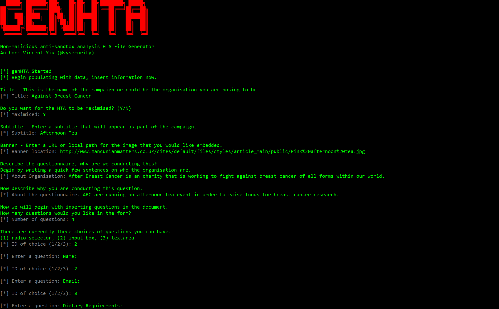
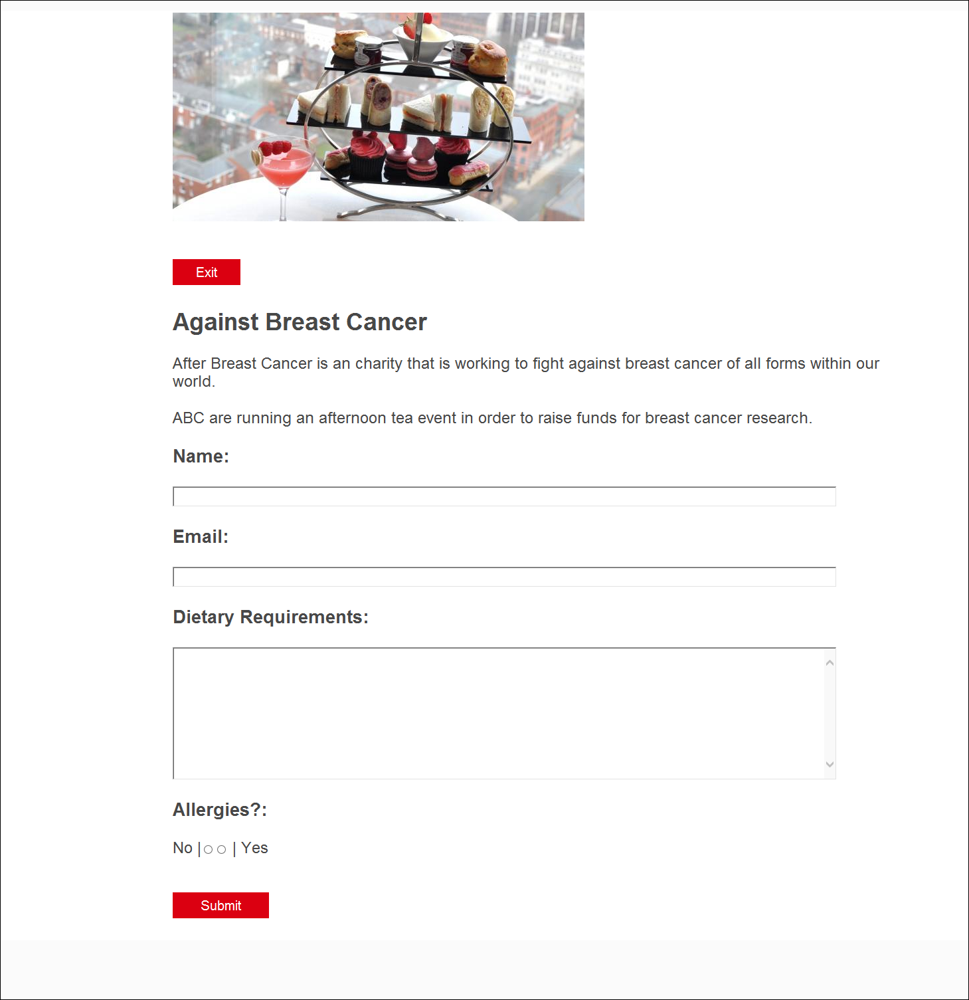

Disclaimer
==========
As usual, this code and tool should not be used for malicious purposes.


genHTA
========



<b>Usage</b>: 
```
python gen-hta.py
 ██████╗ ███████╗███╗   ██╗██╗  ██╗████████╗ █████╗
██╔════╝ ██╔════╝████╗  ██║██║  ██║╚══██╔══╝██╔══██╗
██║  ███╗█████╗  ██╔██╗ ██║███████║   ██║   ███████║
██║   ██║██╔══╝  ██║╚██╗██║██╔══██║   ██║   ██╔══██║
╚██████╔╝███████╗██║ ╚████║██║  ██║   ██║   ██║  ██║
 ╚═════╝ ╚══════╝╚═╝  ╚═══╝╚═╝  ╚═╝   ╚═╝   ╚═╝  ╚═╝

Non-malicious anti-sandbox analysis HTA File Generator
Author: Vincent Yiu (@vysecurity)


[*] genHTA Started
[*] Begin populating with data, insert information now.

Title - This is the name of the campaign or could be the organisation you are posing to be.
[*] Title: Against Breast Cancer

Do you want for the HTA to be maximised? (Y/N)
[*] Maximised: Y

Subtitle - Enter a subtitle that will appear as part of the campaign.
[*] Subtitle: Afternoon Tea

Banner - Enter a URL or local path for the image that you would like embedded.
[*] Banner location: http://www.mancunianmatters.co.uk/sites/default/files/styles/article_main/public/Pink%20afternoon%20tea.jpg

Describe the questionnaire, why are we conducting this?
Begin by writing a quick few sentences on who the organisation are.
[*] About Organisation: After Breast Cancer is an charity that is working to fight against breast cancer of all forms within our world.

Now describe why you are conducting this question.
[*] About the questionnaire: ABC are running an afternoon tea event in order to raise funds for breast cancer research.

Now we will begin with inserting questions in the document.
How many questions would you like in the form?
[*] Number of questions: 4

There are currently three choices of questions you can have.
(1) radio selector, (2) input box, (3) textarea
[*] ID of choice (1/2/3): 2

[*] Enter a question: Name:

[*] ID of choice (1/2/3): 2

[*] Enter a question: Email:

[*] ID of choice (1/2/3): 3

[*] Enter a question: Dietary Requirements:

[*] ID of choice (1/2/3): 1

[*] Enter a question: Allergies?:

[*] How many radio buttons would you like? (1-10): 2
[*] A word to describe the worst option (eg. No, terrible, worst, strongly disagree): No
[*] A word to describe the best option (eg. Yes, fantastic, best, strongly agree): Yes


Submit Message - The message to display after submitting the form.
[*] Submit Message: Thankyou for your interest, we will contact you shortly
[+] Open file: output.hta
[+] Generated HTA
[+] Payload written
```


Example
=======

